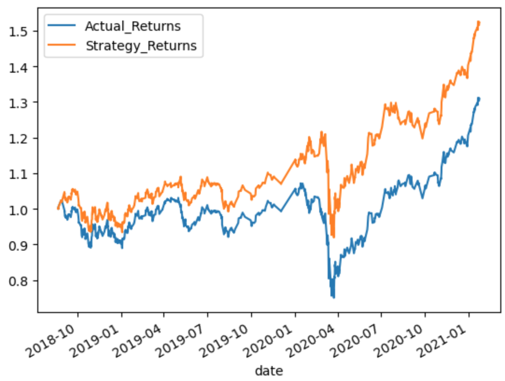

- Implemented an algorithmic trading strategy that uses machine learning to automate the trade decisions. 
- Adjusted the input parameters to optimize the algorithm.
- Trained a new machine learning model and compared its performance to that of a baseline model.

# Machine learning trading bot results

 ## Baseline SVM - accuracy: .64
---

 ## Baseline Log - accuracy: .66 
---

 ## SVM adjusted training dataset (6 month offset instead of 3) - accuracy: .58
  - Increasing the training window resulted in a less accurate model
  ---

 ## SVM with SMA adjusted (from [4,100] to [5,160]) - accuracy: .62
 - It was difficult to find a combination of SMAs that performed better than [4,100]
 ---

 ## SVM with SMA adjusted [5,115] and training offset changed to 2 months - accuracy: .60
 - After playing around with many different combinations of SMAs and training data weights, this combination had the best looking graph as it was consistently beating the actual returns.
 

